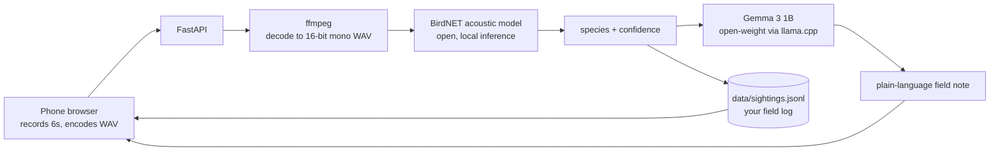

This is a submission for the [Hacktoberfest Open-Source AI Challenge Week 1: Touch Grass](https://dev.to/challenges/hf26).

## What I Built

Touch Grass Birder is a bird call identifier that runs entirely on your own machine.

You tap **Listen**, hold your phone up for six seconds while a bird sings, and it tells you what you are hearing. Then you put the phone away and go look for the bird. That is the whole point: the screen is the shortest part of the experience.

It is built for the places where phone apps usually give up. A trailhead with one bar. A tent before sunrise. A county park where the migrant warblers are passing through and you have no idea what you are listening to.

What it does:

- Records six seconds of audio in the browser and encodes it to WAV on-device.
- Identifies the species locally with **BirdNET**, the open acoustic classifier from the Cornell Lab of Ornithology.
- Writes a short field note about the bird with **Gemma 3 1B**, an open-weight model running through llama.cpp.
- Keeps a field log of everything you have heard, in a plain JSON Lines file you own.
- Installs as a PWA and keeps working with the network turned off.

No API key. No audio upload. No network round trip.

## Demo

<!-- TODO: drop the live Render URL here once deployed, plus a short GIF/video of a real identification -->

Live demo: [RENDER_URL]

## Code

https://github.com/mukuvi/touch-grass-birder — MIT licensed.

## How I Built It

Two open models, both running on the device, wired together behind a small FastAPI server.

The pieces:

- **Browser side:** the MediaRecorder API captures six seconds, an `AudioContext` decodes it, and a small function in `app.js` writes a real 16-bit mono WAV `Blob` before it is sent. No server-side audio processing is needed to get a usable clip.
- **BirdNET** does the acoustic work. It is a model trained on thousands of species specifically for passive acoustic monitoring, and it is the reason this can work at all offline. It loads through the recent LiteRT runtime and stays warm in memory after the first call.
- **Gemma 3 1B** (Q4_K_M, roughly 0.8 GB) is invoked through the `llama.cpp` CLI for a two-or-three sentence field note: what the bird sounds like, where and when you would hear it, and one field mark to look for. If the model is not present, the app simply skips the note and still identifies the bird.
- **FastAPI** ties it together with four endpoints (`/api/identify`, `/api/sightings`, `/api/health`, and the static app), and `data/sightings.jsonl` is the field log.

Everything is configuration-overridable (`LLAMA_BIN`, `GEMMA_MODEL`, `MIN_CONF`, `LLAMA_THREADS`, `BIRDER_DATA_DIR`) so the same code runs on a laptop, a Raspberry Pi, or a phone-adjacent machine.

## Why Does Open Innovation Matter?

This project only exists because the models are open.

**A closed bird ID API cannot work where birds are.** Every closed identifier needs a round trip to a server. The best places to hear birds are exactly the places with no signal. Running BirdNET locally means the app is not a worse version of a cloud service in the backcountry, it is the only version that works there at all. The screen time is six seconds because there is no upload, no spinner, no retry; the answer is already on the device.

**Location data stays on the device.** A rare sighting is sensitive. A closed app learns where you were and when, which is a real concern for anyone watching nesting sites or reporting a scarce species. Here the only record is a line in a file you own, on hardware you control. The app never has a server to send it to.

**Open weights mean I can change the model.** Gemma runs from a local GGUF, so swapping to a larger Gemma, a different quantization, or a completely different model is a path change and an environment variable, not a vendor negotiation. I can fine-tune on my own regional species list later, and the bird classifier itself, BirdNET, is open source and inspectable, which matters when the output is a claim about the natural world.

**It costs nothing to run.** There is no per-identification fee, no rate limit, and no API key to expire. A birder on a budget, a school group, or a citizen-science project can run this indefinitely.

The open pieces are not a compromise here. They are the feature. The offline, private, zero-cost version is strictly better than the closed one for the use case the app is actually for.

<!-- TODO (optional, worth bonus points): add a sentence or two about a real walk where you used it. e.g. "I took it to ___ on ___ and it correctly called a ___." -->

## My Agent Session

I built this with an agent, and the session is saved so you can see the process:



## Prize Categories

- **Best Use of Gemma** — Gemma 3 1B runs locally via llama.cpp and generates the field notes.
- **Best Use of Render** — the live demo is deployed on Render with the included `render.yaml`.

---

*Built for Hacktoberfest 2026. Files, models, and data never leave the machine: no key, no upload, no network.*
